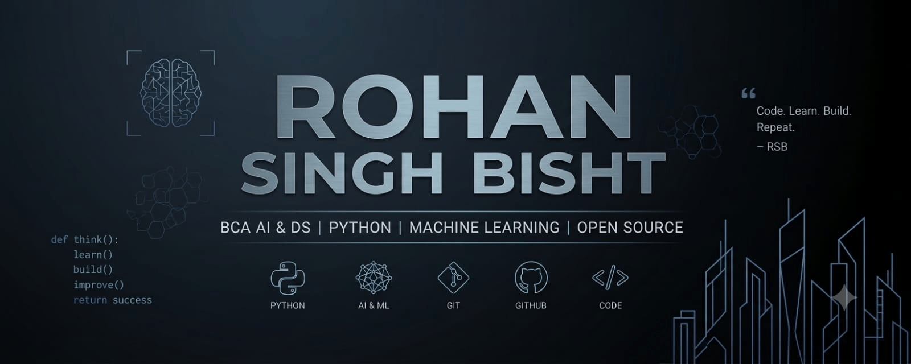

  

# Hi there, I'm Rohan Singh Bisht 👋

### BCA AI & DS | Python | Machine Learning | Open Source

I'm a BCA (Hons.) Artificial Intelligence & Data Science student passionate about building practical software, exploring machine learning, and continuously improving as a developer.

---

### 🚀 About Me

- 🎓 Currently pursuing **BCA (Hons.) in Artificial Intelligence & Data Science**
- 🔭 Currently working on personal Python & ML projects
- 🌱 Learning more about **Machine Learning**, **Data Science**, and **Open Source contribution**
- 💡 Interested in building practical, real-world software rather than just theory
- 📫 Reach me at **ROHNisDEVING@outlook.com**

---

### 🛠️ Tech Stack

  
  
  
  
  
  
  
  
  
  

---

### 📌 Featured Projects

- **[Mini-Games](https://github.com/rohn-dev/Mini-Games)** — A collection of small games built for practice and fun.
- **[Python-Projects-](https://github.com/rohn-dev/Python-Projects-)** — A set of Python scripts and mini-projects covering various concepts.
- **[Student-Dashboard-UI](https://github.com/rohn-dev/Student-Dashboard-UI)** — A UI for a student dashboard.

---

### 📊 GitHub Stats

  
  

  

---

### 📫 Connect With Me

  
  

---

  

*Thanks for stopping by — feel free to explore my repositories and reach out!*

