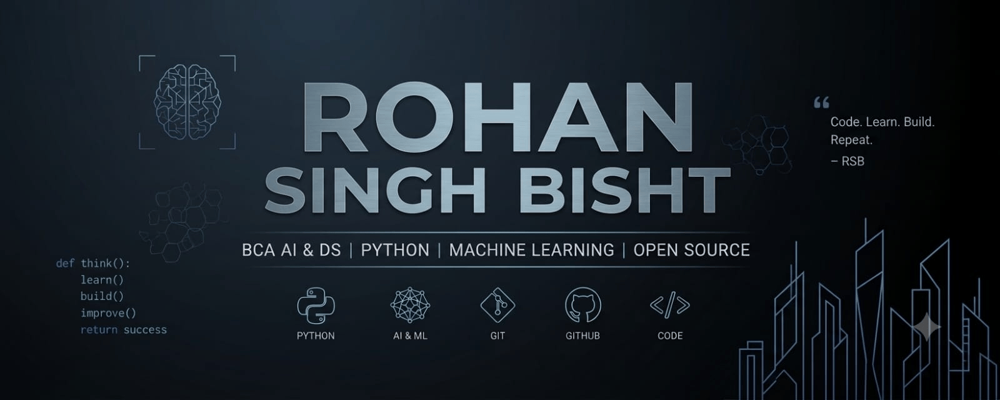

  

# Rohan Singh Bisht

### BCA (Hons.) Artificial Intelligence & Data Science

*Somewhere between a dataset and a dream, I build things that work.*

---

### About Me

I study Artificial Intelligence & Data Science, but most of what I've learned came from taking things apart — code, ideas, assumptions — and seeing what still stands afterward.

- Pursuing **BCA (Hons.) in Artificial Intelligence & Data Science**
- Building personal **Python** and **Machine Learning** projects, slowly and deliberately
- Drawn to **open source** as a way of thinking out loud in public
- More interested in software that does something than software that says something
- Reachable at **[ROHNisDEVING@outlook.com](mailto:ROHNisDEVING@outlook.com)**

---

### Tech Stack

  
  
  
  
  
  
  
  
  

---

### Featured Projects

Small worlds, built to see what happens inside them.

- **[Mini-Games](https://github.com/rohn-dev/Mini-Games)** — A collection of small games, built for the pleasure of finishing something.
- **[Python-Projects-](https://github.com/rohn-dev/Python-Projects-)** — A set of scripts and experiments, each one a question I wanted answered.
- **[Student-Dashboard-UI](https://github.com/rohn-dev/Student-Dashboard-UI)** — An interface for a student dashboard, built with the user's attention in mind.

---

### GitHub Stats

  
  
  

---

### Connect With Me

  
  

---

  

*If you've read this far, you already know more about me than most conversations manage. The repositories say the rest.*

